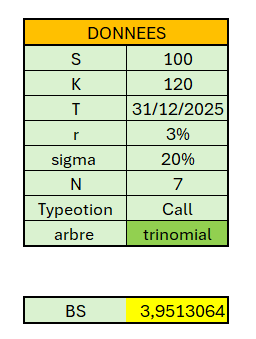
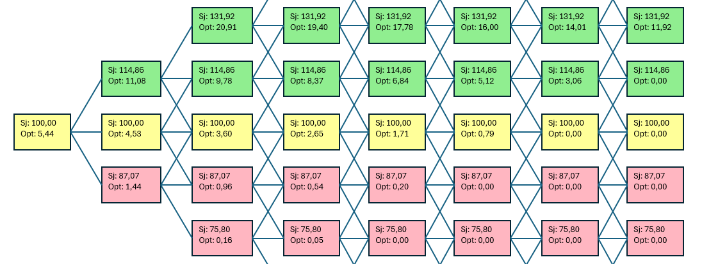
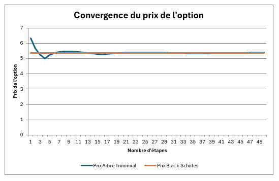

# VBA option pricing project
 This project provides a VBA-based solution for calculating and visualizing option prices using trinomial and binomial trees. It includes Black-Scholes pricing, option convergence analysis, and interactive tree visualization.


# 📊 **VBA Option Pricing Project**

This project provides a **VBA-based solution** for calculating and visualizing option prices using trinomial and binomial trees. It includes Black-Scholes pricing, option convergence analysis, and interactive tree visualization.

---

## **How It Works**

### **1. Parameter Input**
- Fill in the required parameters in the **green table** on the Excel sheet (e.g., spot price, strike price, volatility, risk-free rate).
- Supported options: **American Call Option**.
- The yellow cell calculates the price using the **Black-Scholes formula**.



---

### **2. Option Tree Display**
Select the type of tree (`trinomial` or `binomial`) by entering the value in cell **B10**, then click the **"Display Tree"** button.  
This generates an option pricing tree on the sheet starting from cell **E50**.




```vba
Sub DisplayOptionTree()
    Dim ws As Worksheet
    Set ws = ActiveSheet

    ' Check tree type and call corresponding procedure
    If ws.Range("B10").Value = "trinomial" Then
        Call ArbreTrinomial
    ElseIf ws.Range("B10").Value = "binomial" Then
        Call DisplayBinomialTree
    Else
        MsgBox "Please enter 'trinomial' or 'binomial' in cell B10."
    End If
End Sub
```

- The **trinomial tree** includes upward, downward, and stable price changes at each node.
- Nodes display the stock price (`Sj`) and the option price (`Opt`).

---

### **3. Convergence Analysis**
- Click the **"Convergence Graph"** button to generate a plot starting from column **AC**.
- The graph shows the convergence of the trinomial option price towards the Black-Scholes price as the number of tree steps increases.

```vba
Sub GenererGraphiqueConvergence()
    ' Generate the convergence graph based on trinomial calculations
    ' Data is displayed in columns X, Y, and Z for further visualization.
    Call TracerGraphiqueConvergence(ActiveSheet, 50)
End Sub
```


---

### **4. Cleaning the Sheet**
- Click the **"Delete All"** button to:
  - Remove all tree-related shapes (nodes, lines).
  - Clear previous convergence data from columns **X:Z**.

```vba
Sub SupprimerArbreGraphiqueEtColonnes()
    ' Remove all shapes and data related to the option tree and convergence graph
    ActiveSheet.Shapes.SelectAll
    ActiveSheet.Shapes.Delete
    ActiveSheet.Range("X:Z").ClearContents
End Sub
```

---

## **Tips and Notes**
- For large tree sizes (`N > 12`), node overlap may occur. Adjust the starting position by modifying **cell E50** in the VBA code (e.g., change to **E100**).
- Need help? Contact **Christelle** or **Grégoire** (Tropaze room, Building C).

---

## **How to Use**
1. **Clone the Repository**  
   Clone the GitHub repository to download the code and Excel files:
   ```bash
   git clone https://github.com/YourUsername/YourRepoName.git
   ```

2. **Set Up the Excel Workbook**  
   Ensure macros are enabled and fill in the parameter table.

3. **Run the Macros**  
   Click the buttons to generate the tree visualization, convergence graph, or clean the sheet.

4. **Explore the Code**  
   Modify the VBA code if needed to customize the starting positions or visual styles.

Enjoy using the project!
```
